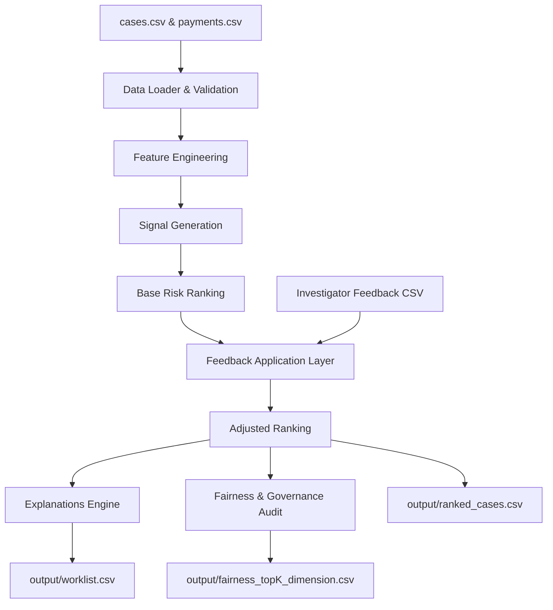

# Brite Spark 2026 — Problem 6: The Overpayment Signal

An explainable investigation-prioritisation system for identifying benefit cases that warrant human review.

## 📌 Problem Overview

This project implements a complete, production-ready pipeline for identifying and prioritising cases with potential payment anomalies (such as overpayments). The system processes synthetic case data and payment logs to output a ranked worklist of the top 20 cases most worth reviewing, accompanied by plain-language explanations and supporting evidence.

The pipeline is built with a strong focus on **explainability**, **demographic fairness**, and the **Day-2 ability to absorb investigator feedback** without retraining or model code modifications.

---

## 🏗️ Pipeline Architecture

The pipeline processes data through a sequence of modular components:



1. **Data Loader & Validation (`data_loader.py`)**: Loads cases and payments data, validating formats, schemas, duplicates, and referential integrity.
2. **Feature Engineering (`feature_engineering.py`)**: Computes month-by-month and aggregate payment-to-award ratios, persistence metrics, duplicate patterns, and temporal variations.
3. **Signal Generation (`signals.py`)**: Transforms engineered features into normalized, threshold-based financial risk signals (0.0 to 1.0).
4. **Ranking Engine (`ranking.py`)**: Computes a weighted sum of the financial signals to produce a transparent base score.
5. **Feedback Application Layer (`feedback.py`)**: Loads external investigator feedback and applies signal-level adjustments (e.g., downweighting or upweighting a specific signal category) without requiring model retraining.
6. **Explanations Engine (`explanations.py`)**: Generates plain-language review reasons and a detailed month-by-month payment breakdown for human investigators.
7. **Fairness Audit (`fairness.py`)**: Runs population representation audits across multiple cutoffs ($k = 20, 50, 100, 200$) across demographics (`age_band`, `language_preference`, `district`, `tenure`) to monitor representation and selection ratios.

---

## 📁 Project Structure

```text
brite-spark-problem-6/
│
├── data/
│   ├── cases.csv
│   ├── payments.csv
│   └── feedback/
│       └── investigator_feedback.csv  # Investigator feedback records
│
├── src/
│   ├── __init__.py
│   ├── data_loader.py                 # Data validation and loading
│   ├── feature_engineering.py          # Payment feature extraction
│   ├── signals.py                      # Threshold-based signal generation
│   ├── ranking.py                      # Scoring and ranking logic
│   ├── explanations.py                 # Plain-language explanation builder
│   ├── fairness.py                     # Demographic fairness analytics
│   ├── feedback.py                     # Signal-level feedback adjustments
│   └── pipeline.py                     # Orchestrates end-to-end pipeline execution
│
├── tests/
│   ├── __init__.py
│   ├── test_data_loader.py
│   ├── test_features.py
│   ├── test_signals.py
│   ├── test_ranking.py
│   ├── test_explanations.py
│   ├── test_fairness.py
│   ├── test_feedback.py
│   └── test_pipeline.py
│
├── output/                             # Generated pipeline deliverables
│   ├── worklist.csv                    # Top 20 cases for review with explanations
│   ├── ranked_cases.csv                # Full ranked dataset
│   ├── feedback_comparison.csv         # Before vs. after feedback scores
│   ├── fairness_top<K>_<dim>.csv       # Fairness report files
│   └── run_summary.txt                 # Execution metadata summary
│
├── notebooks/
│   └── 01_data_exploration.ipynb
│
├── README.md
├── DECISIONS.md
├── AI-USAGE.md
├── requirements.txt
├── .gitignore
└── main.py                             # Main execution script
```

---

## 🚀 Running the Project (Clean-Clone Simulation)

Ensure you have Python 3.10+ installed. To replicate the execution in a fresh workspace:

### 1. Set Up Virtual Environment
```powershell
python -m venv .venv
.venv\Scripts\activate
```

### 2. Install Dependencies
```powershell
pip install -r requirements.txt
```

### 3. Run the Pipeline
```powershell
$env:PYTHONIOENCODING="utf-8"
python main.py
```
This runs the full end-to-end pipeline, prints a formatted summary table of the Top 20 cases with reasons and monthly breakdowns to the console, and writes the output files to the `output/` directory.

### 4. Run Automated Tests
```powershell
python -m pytest
```
Runs all **25 automated tests** validating data validation, feature extraction, signal thresholds, feedback application, fairness metrics, and end-to-end runs.

---

## 📊 Summary of Outputs

The following files are written to the `output/` folder upon completion:
* **`worklist.csv`**: The Top 20 prioritized cases with scores, explanations (`reason`), and concise metrics (`evidence`).
* **`ranked_cases.csv`**: All 4,200 cases sorted by their adjusted scores.
* **`feedback_comparison.csv`**: Shows the pre-feedback `investigation_score`, post-feedback `adjusted_score`, and the resulting change in scores/ranks.
* **`fairness_top<K>_<dimension>.csv`**: Contains selection rates, population rates, and selection ratios across demographics for cutoffs $k \in \{20, 50, 100, 200\}$.
* **`run_summary.txt`**: Logs file size and row count metadata from the run.

---

## ⚖️ Automated-Decision Boundary & Limitations

> [!IMPORTANT]
> **Strict Operational Boundary**:
> This system is designed solely as an **investigation-prioritisation tool** to guide human review worklists. It is not an automated decision-making system. It does not establish that any payment is improper, and it **must not** be used to automatically suspend, terminate, reduce, or recover benefits.

### Limitations
1. **Sample Size for Fairness Cutoffs**: At a cutoff of $k=20$, each case represents 5% of the selection. One should not draw definitive statistical conclusions on systemic bias from the Top 20 alone; instead, monitor the trends across $k=100$ and $k=200$.
2. **Exclusion of Administrative Variables**: To prevent operational bias, variables like administrative adjustments, contact attempts, and demographic information are excluded from the core financial scoring formula. They are only reviewed in post-hoc governance logs.